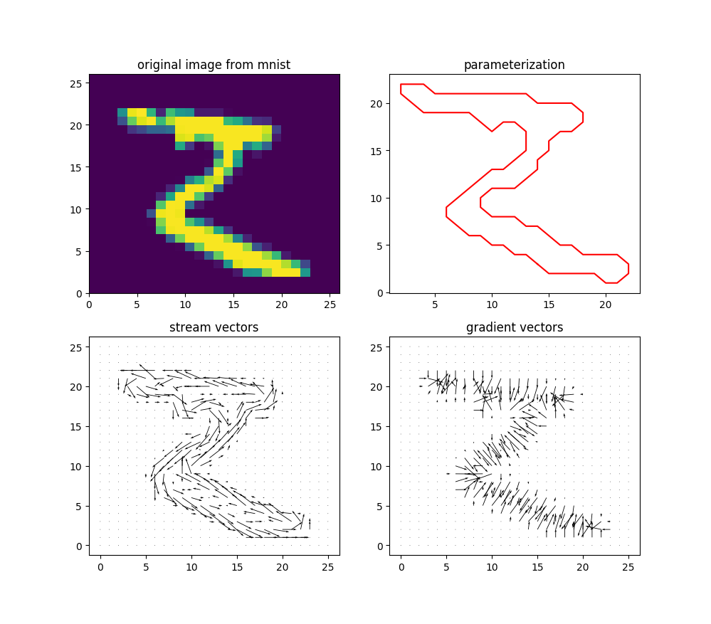
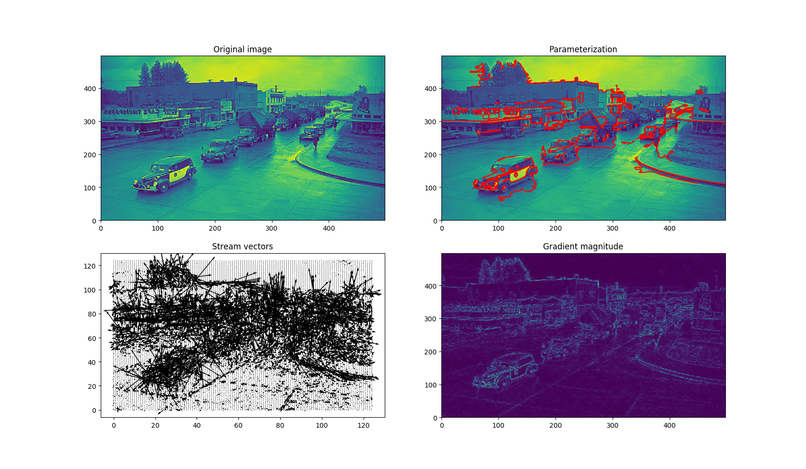

[](https://travis-ci.org/jloveric/image-processing)

# Image Processing

This is an experiment in parameterizing objects in images.  A goal here is to use the parameterization in an image recognition technique that is scale, shift and rotation invariant.  The parameterization can be used to translate 2D shapes into 1D representation.  A work in progress.

# Installation

```bash
pipenv install snovalleyai-image-processing
```

# Loading

```python
from snovalleyai_image_processing import *
```
## Example 1 - mnist digit



## Example 2 - old North Bend Washington downtown
