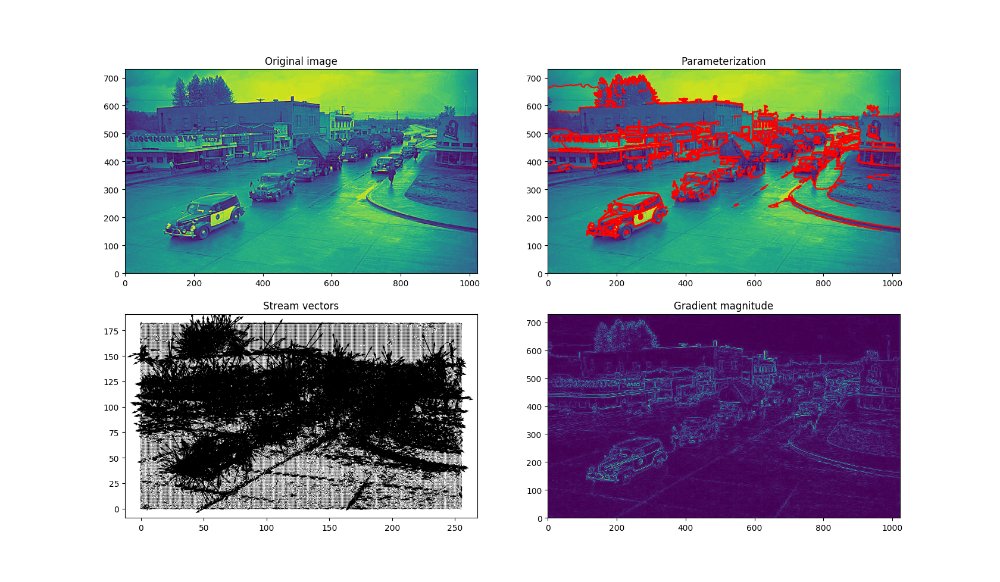

# Image Processing

This is an experiment in parameterizing objects in images.  A goal here is to use the parameterization in an image recognition technique that is scale, shift and rotation invariant.  A work in progress.

## Example 1 - mnist digit

## Example 2 - old North Bend Washington downtown
